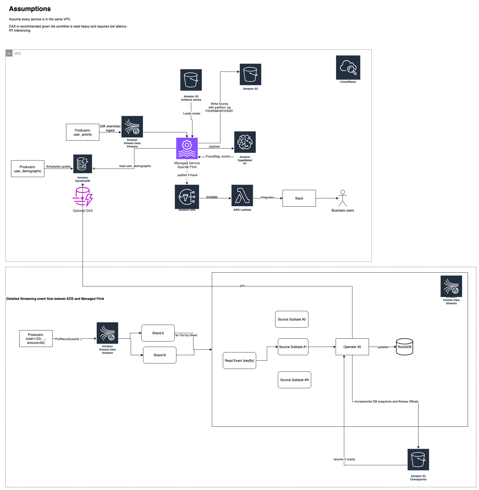

### Architecture Diagram 



### End-to-end workflow (brief)
- Producers write `user_activity` events to Kinesis (~30k/sec).
- Kinesis Data Analytics (Flink) consumes the stream and:
  - validates the event schema;
  - maintains rolling aggregates keyed by `user_id`;
  - joins with `user_demographic` (DynamoDB point lookups, cached in operator state);
  - loads the exact training scaler from S3 and applies it to features;
  - invokes the SageMaker realtime endpoint for a fraud score;
  - writes scores to S3 (partitioned by date) and publishes suspicious ones to SNS.
- Lambda subscribed to SNS posts a compact Slack alert enriched with key demographics.
- Metrics and logs go to CloudWatch.

### Design choices & trade-offs
- Streaming engine (Managed Flink/KDA):
  - Pros: built-in state, keyed timers, exactly-once sinks, good for joins/rolling windows at steady high throughput.
  - Cons: higher baseline cost and operational concepts vs. simple Lambda; requires packaging a job artifact.
- Exact-as-trained scaling:
  - Scaler artifact is versioned in S3 with the model; Flink loads once and applies per record → avoids training/serving skew.
  - Alternative (embed in model container) duplicates logic in two places; chosen approach centralizes transforms.
- `user_demographic` reference table:
  - DynamoDB (PAY_PER_REQUEST) for low-latency point reads by `user_id`; optional DAX if read pressure grows.
  - Trade-off: eventual consistency after hot updates; Aurora were considered but are heavier for simple key-value lookups.
- Model inference (SageMaker endpoint):
  - Pros: autoscaling, model registry compatibility, metrics; predictable latency under load.
  - Cons: per-hour cost; Lambda container could be cheaper but is tighter on cold start and heavier libs.
- Alerts path:
  - SNS decouples producers/consumers; Lambda handles Slack webhook. Simple, auditable, and easy to fan-out later.

### Local run & quick test
- Run the API locally (uv recommended):
```
uv run uvicorn src.inference:app --host 0.0.0.0 --port 8000
```
- Smoke test with the provided `example.json`:
```
curl -X POST http://localhost:8000/infer \
  -H 'Content-Type: application/json' \
  --data @example.json
```
Example response:
```
{"fraud_flag": false, "fraud_probability": 0.4042387390188852}
```

### Docker
- Build:
```
docker build -t fraud-inference:local .
```
- Run:
```
docker run --rm -p 8000:8000 fraud-inference:local
```

### Tests
Run with uv:
```
uv run pytest -q
```
